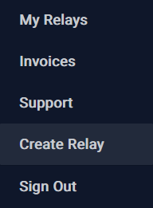

<p align="center">
  
</p>
<br>

<p align="center">
  Welcome to the relay.tools installation guide!
</p>
<br>

If you already have an instance of `relay.tools` set up, you may be looking for the [documentation](docs.md)!

If you would like to install `relay.tools` locally, check out the [local install guide](relaytools-setup.md)!

# Installation
```
git clone https://github.com/relaytools/relay-tools-images.git
cd relay-tools-images/machines
./prereqs.sh
./build
```
<p align="center">
  This is a good time to grab some coffee. ☕ (Average time: 15-20m)
</p>

# Configuration

>**Change `your.domain` to your own domain.**
```
export MYDOMAIN=your.domain
./configure.sh
machinectl enable mysql && machinectl enable strfry && machinectl enable relaycreator && machinectl enable haproxy
reboot
```

# Relay Creation

- Navigate to your domain in a browser and authorize with NIP-07 extension

<p align="center">
  
</p>

- Select 'create relay' from the drop-down menu

<p align="center">
  
</p>

- Create some relays!

<p align="center">
  
</p>

- Feel free to check out some of the other [documentation](docs.md)!
